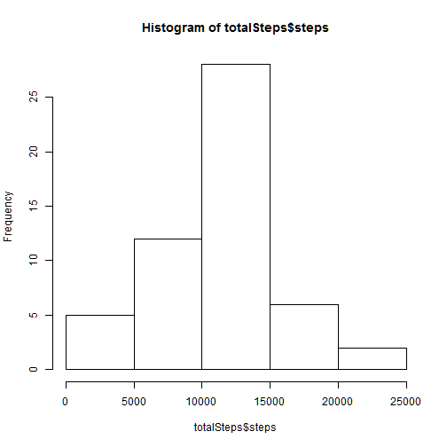
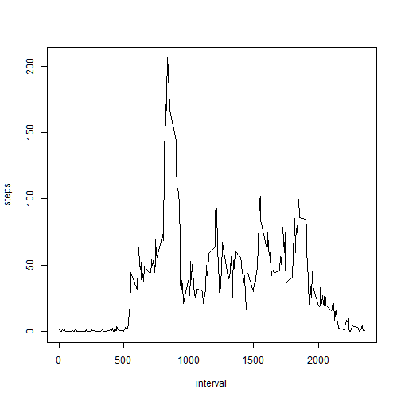
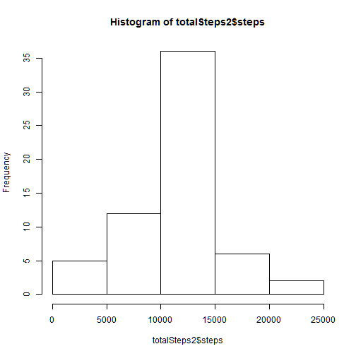
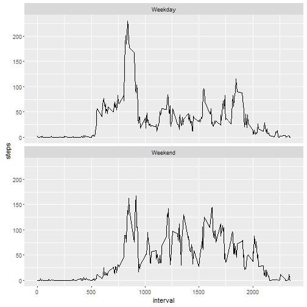

Assessment 1 - Week 2
====================================================

1. Loading data
---------------


```r
activity=read.csv("activity.csv")
```

* Process/transform the data (if necessary) into a format suitable for your analysis


```r
totalSteps<-aggregate(steps~date,data=activity,sum,na.rm=TRUE)
```


2. What is mean total number of steps taken per day?
---------------------------------------------------

* Make a histogram of the total number of steps taken each day


```r
hist(totalSteps$steps)
```



* Calculate and report the mean and median of the total number of steps taken per day

```r
mean(totalSteps$steps)
```

```
## [1] 10766.19
```

```r
median(totalSteps$steps)
```

```
## [1] 10765
```

3. What is the average daily activity pattern?
----------------------------------------------

* Series plot


```r
stepsInterval<-aggregate(steps~interval,data=activity,mean,na.rm=TRUE)
plot(steps~interval,data=stepsInterval,type="l")
```



* Which 5-minute interval, on average across all the days in the dataset, contains the maximum number of steps?


```r
stepsInterval[which.max(stepsInterval$steps),]$interval
```

```
## [1] 835
```

The maximum average steps per period occur at interval **835th**

4. Imputing missing values
--------------------------

* Calculate and report the total number of missing values in the dataset.


```r
sum(is.na(activity$steps))
```

```
## [1] 2304
```

2304 values are missing

* Devise a strategy for filling in all of the missing values in the dataset.

Missing values for steps per interval are replaced by the mean number of steps for that interval, calculated on the non-missing rows. A new dataset is created that contains these imputed values.


```r
library(plyr)
new.mean <- function(x) replace(x, is.na(x), mean(x, na.rm = TRUE))
activity.new <- ddply(activity, ~interval, transform, steps = new.mean(steps) )
```

* Make a histogram of the total number of steps taken each day and Calculate and report the mean and median total number of steps taken per day.


```r
totalSteps2<-aggregate(steps~date,data=activity.new,sum)
hist(totalSteps2$steps)
```



```r
mean(totalSteps2$steps)
```

```
## [1] 10766.19
```

```r
median(totalSteps2$steps)
```

```
## [1] 10766.19
```

* Do these values differ from the estimates from the first part of the assignment? What is the impact of imputing missing data on the estimates of the total daily number of steps?

This median of value has decreased, maybe because the median values contain the mean values imputed to them.


5. Are there differences in activity patterns between weekdays and weekends?
----------------------------------------------------------------------------
* Create a new factor variable in the dataset with two levels - "weekday" and "weekend" indicating whether a given date is a weekday or weekend day.


```r
activity.new$dateP <- as.POSIXlt(activity.new$date,format="%Y-%m-%d")
activity.new$day <- "Weekday"
activity.new$day [weekdays(activity.new$dateP) %in% c("sábado","domingo")] <- "Weekend"
```

* Make a plot


```r
activity.new.week <- aggregate(steps~interval+day , activity.new, mean) 

library(ggplot2)

plot <- ggplot(data=activity.new.week, aes(x=interval, y = steps))

plot + geom_line() + facet_wrap(~day,nrow=2)
```




